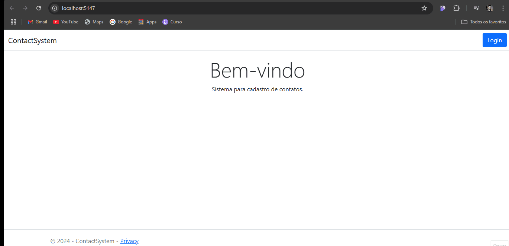
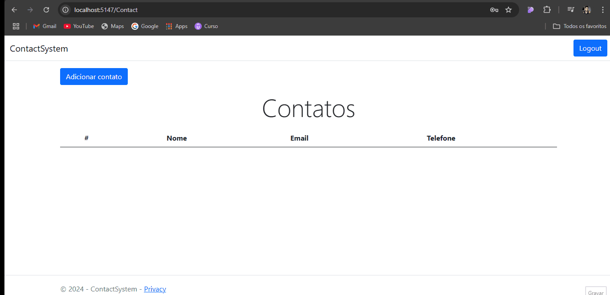
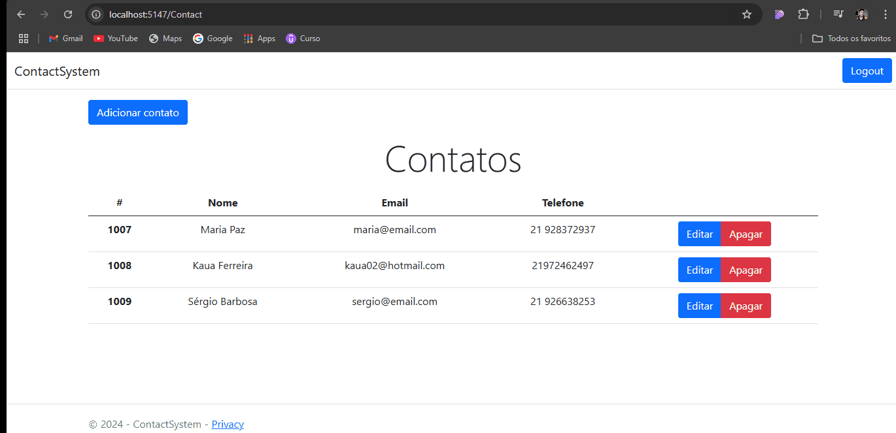

<h1 align="center">Contact System</h1>
<p align="center">Um aplicativo para controle de contatos feito em C#</p>

## Features ✨
<br>

- [x] Cadastro de usuários
- [x] Login de usuários
- [x] Logout de usuários
- [x] Listar Contatos
- [x] Adicionar Contatos
- [x] Apagar Contatos
- [x] Editar Contatos 

## Demo 📷


<h1 align="center">
    
</h1>

<h1 align="center">
    
</h1>

<h1 align="center">
    
</h1>


<h1 align="center">
    
</h1>

## Pré requisitos

- [Git](https://git-scm.com)
- [.NET](https://dotnet.microsoft.com/en-us/download)

É bom que tenha um [VisualStudio](https://visualstudio.microsoft.com/pt-br/downloads/) para editar o código

<br>

## Tecnologias

- [C#](https://learn.microsoft.com/pt-br/dotnet/csharp/)
- [.NET](https://dotnet.microsoft.com/pt-br/)
- [ASP.NET CORE MVC](https://dotnet.microsoft.com/pt-br/apps/aspnet/mvc)

---

## Rodando a aplicação

```bash
   #Clone o repositório
   git clone https://github.com/Kakaziu/Contact-System

   # Ir até a pasta

   cd ContactSystem

   dotnet run
```

Obrigado a atenção de quem veio até aqui 🧡 | [Linkedin](https://www.linkedin.com/in/kau%C3%A3-borba-390946235/) 
